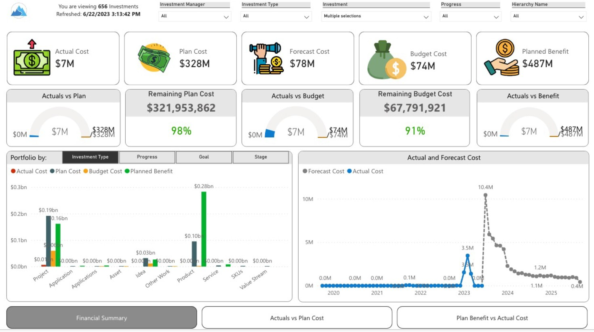

# 📊 Financial Summary Dashboard

## 🧩 Business Objective

Provide a consolidated financial view of program and project investments to:

* Compare **actual costs vs planned costs**
* Track **planned benefits vs realized spend**
* Enable better financial governance and decision-making
* Identify cost overruns and investment inefficiencies

---

## 🔗 Live Dashboard
👉 [View Interactive Power BI Report](https://app.powerbi.com/view?r=eyJrIjoiMmI2YjBlMDMtOGIxMi00NTQ2LTg5NTMtYTY5MTc5NmNlZDRjIiwidCI6IjQ3NzEwMzc2LTNiZTUtNGMwYS04YjBjLTUxOGVmMDljMWQ3YiIsImMiOjZ9)

---
## 💡 Solution Overview

Developed a Power BI dashboard to deliver **end-to-end financial visibility** across programs and projects.

The solution enables stakeholders to monitor financial performance, evaluate ROI, and align investments with business objectives.

---

## 📈 Key Report Views

### 💰 Financial Overview

* Financial Summary

### 📊 Cost vs Plan Analysis

* Actuals vs Planned Costs

### 📉 Investment Effectiveness

* Planned Benefit vs Actual Cost

---

## 🏗️ Data Model & Approach

* Designed a **Star Schema** integrating financial and project data
* Fact Tables: Actual Costs, Planned Costs, Benefits
* Dimension Tables: Time, Project, Program, Cost Category
* Enabled time-based and program-level financial analysis

---

## 📊 Dashboard Preview

### Financial Summary View

This view provides a high-level comparison of planned vs actual financials, helping identify cost variances and investment performance.

---

## 📄 Full Dashboard (PDF)

[Download Financial Summary Dashboard](./financial_summary.pdf)

---

## ⚙️ Technical Highlights

* DAX measures for variance analysis (Actual vs Planned)
* Time intelligence for trend and period comparisons
* KPI indicators for cost overrun and benefit realization
* Optimized data model for financial reporting performance

---

## 🎯 Business Impact

* Improved financial transparency across programs
* Enabled proactive identification of cost overruns
* Supported data-driven investment decisions
* Enhanced tracking of ROI and benefit realization

---

## 🔒 Data Note

This project uses **masked/sample data** due to confidentiality constraints.

---
