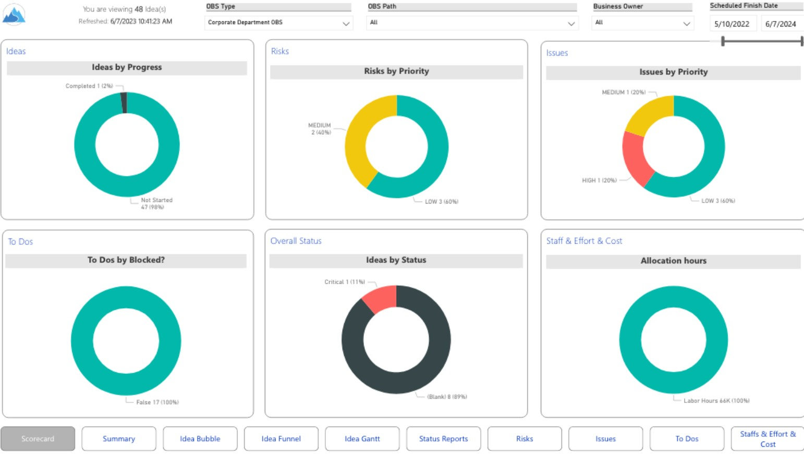
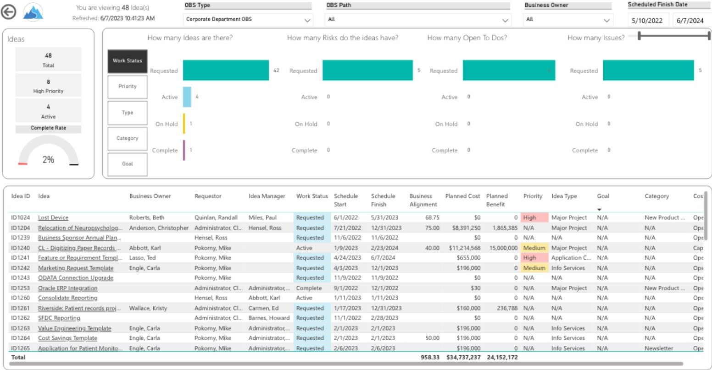

# 💡 Idea Summary Dashboard

## 📌 Overview
The Idea Summary Dashboard provides a comprehensive view of the idea pipeline, enabling stakeholders to prioritize, analyze feasibility, and track progress from ideation to execution.

This dashboard helps organizations streamline innovation management by offering real-time insights into idea status, effort, and resource allocation.

---

## 🎯 Business Problem
Organizations often struggle with:
- Lack of visibility into idea pipelines
- Difficulty prioritizing high-value ideas
- Inefficient tracking of idea progress and execution
- Limited insight into resource allocation and effort

---

## 💡 Solution
Developed an interactive Power BI dashboard to:
- Visualize idea pipeline using multiple perspectives
- Track idea progress from submission to execution
- Analyze feasibility and prioritization
- Monitor resource effort and staffing

---

## 📊 Key Features / Report Views
- **Idea Bubble** – Visual comparison of ideas based on impact and effort  
- **Idea Details** – Deep dive into individual idea attributes  
- **Idea Funnel** – Pipeline stages and conversion tracking  
- **Idea Gantt** – Timeline view of idea execution  
- **Idea Overview** – High-level summary of all ideas  
- **Idea Staff and Effort** – Resource allocation insights  
- **Idea Status** – Current state tracking  
- **Idea To Dos** – Task-level tracking for execution  

---

## 🛠️ Tools & Technologies
- Power BI (Data Modeling, DAX, Visualization)
- Star Schema Data Model
- Data Transformation (Power Query)

---

## 📸 Dashboard Screenshots

### Idea Overview

This view provides a high-level snapshot of all ideas, enabling stakeholders to quickly assess pipeline health, priorities, and overall progress

### Idea Details

This view offers a detailed breakdown of individual ideas, including key attributes, status, effort, and feasibility for informed decision-making.

---

## 📄 Full Dashboard
👉 [Download Full Dashboard PDF](ideasummary_dashboard.pdf)

---

## 🚀 Key Highlights
- Designed for executive-level decision-making
- Enables data-driven prioritization of ideas
- Improves visibility into innovation pipeline
- Scalable model adaptable to portfolio/project management tools (e.g., Clarity PPM)

---
