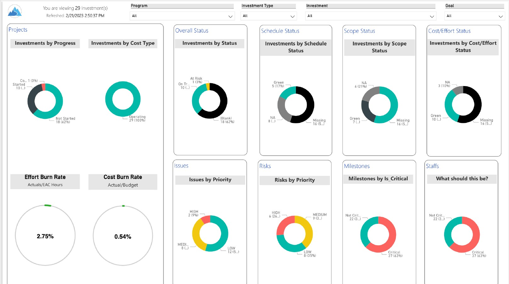
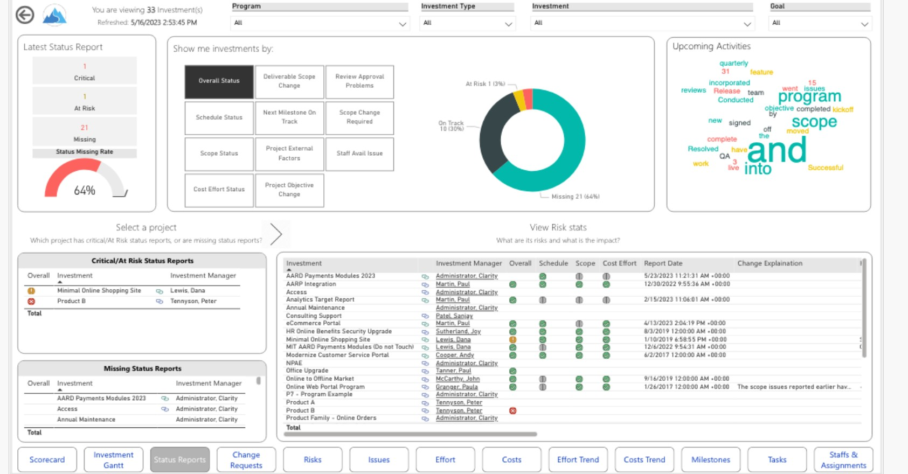

# 📊 Program Dashboard

## 🧩 Business Objective

Provide a comprehensive view of **program-level performance**, enabling stakeholders to:

* Track milestones and deliverables
* Monitor costs and effort
* Identify risks and issues early
* Assess overall program health

---

## 💡 Solution Overview

Developed an interactive Power BI dashboard to consolidate program data into a **single source of truth**, replacing fragmented and manual reporting.

The dashboard enables **real-time visibility** into program execution and supports data-driven decision-making.

---

## 📈 Key Report Views

### 📌 Program Overview

* Program Summary
* Program Status Reports
* Program Drill Through

### 💰 Financial Tracking

* Program Costs
* Program Costs Trend

### ⏱️ Planning & Execution

* Program Gantt
* Program Tasks
* Program Milestones
* Program Effort

### ⚠️ Risk & Issue Management

* Program Risks
* Program Issues
* Change Requests

### 👥 Resource Management

* Program Staff

---

## 🏗️ Data Model & Approach

* Designed a **Star Schema** data model integrating multiple sources
* Fact Tables: Program Costs, Effort, Tasks
* Dimension Tables: Time, Program, Resource, Status
* Optimized for performance and scalability

---
## 📄 Dashboard Preview

## 📄 Full Dashboard (PDF)

---

## ⚙️ Technical Highlights

* Advanced DAX measures for KPI tracking (cost variance, effort utilization)
* Drill-through and cross-filtering capabilities
* Trend analysis using time intelligence functions
* Performance optimization for large datasets

---

## 🎯 Business Impact

* Eliminated manual reporting and Excel-based tracking
* Improved visibility into program health across stakeholders
* Enabled proactive risk and issue management
* Accelerated decision-making with real-time insights

---

## 🔒 Data Note

This portfolio project uses **masked/sample data** due to confidentiality constraints.

---

