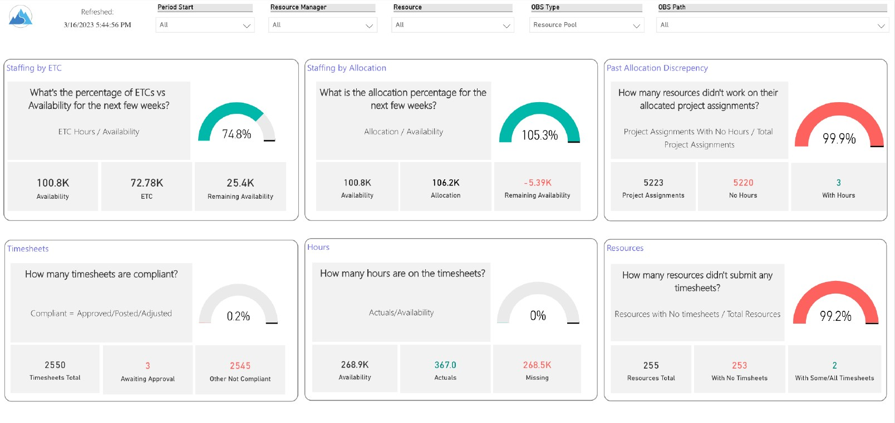
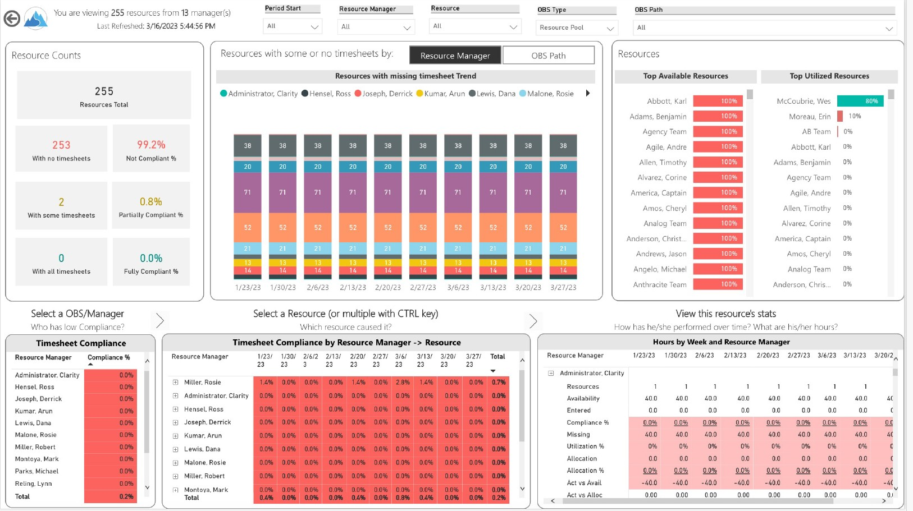

# 📊 Resource Manager Dashboard

## 🧩 Business Objective

Enable resource managers and leadership to:

* Evaluate resource allocation across projects
* Identify bottlenecks and over/under-utilization
* Optimize staffing and capacity planning
* Align skills with project demands

---

## 🔗 Live Dashboard
👉 [View Interactive Power BI Report](https://app.powerbi.com/view?r=eyJrIjoiZGEzYmE4ZGYtYjgyZi00NjhmLWFhMjItODg1MjNjZDM1ZDIzIiwidCI6IjQ3NzEwMzc2LTNiZTUtNGMwYS04YjBjLTUxOGVmMDljMWQ3YiIsImMiOjZ9)

---

## 💡 Solution Overview

Developed an interactive Power BI dashboard to provide **end-to-end visibility into resource utilization and staffing** across programs and projects.

The dashboard consolidates multiple data sources into a **single, actionable view** for resource planning and decision-making.

---

## 📈 Key Report Views

### 👥 Resource Overview

* Resource Summary
* Resource Detail

### 🧠 Skills & Capability Tracking

* Resource Skills

### 📋 Work & Allocation Tracking

* Resource Tasks
* Staffing Allocations
* Staffing ETC

### ⚠️ Exception Monitoring

* Allocation Discrepancies

---

## 🏗️ Data Model & Approach

* Designed a **Star Schema** integrating resource, project, and allocation data
* Fact Tables: Resource Allocation, Tasks, ETC
* Dimension Tables: Resource, Project, Time, Skill
* Enabled efficient slicing by team, role, and time

---

## 📊 Dashboard Preview

### Resource Summary View

This view provides a high-level overview of resource utilization, highlighting over- and under-utilized resources.

---

### Resource Detail View

This view enables drill-down into individual resource allocations, tasks, and workload distribution.

---

## 📄 Full Dashboard (PDF)

[Download Resource Manager Dashboard](./resourcemanager_dashboard.pdf)

---

## ⚙️ Technical Highlights

* Advanced DAX for utilization %, capacity vs allocation analysis
* Drill-through from summary to resource-level detail
* Time intelligence for ETC and workload forecasting
* Optimized model for performance with large datasets

---

## 🎯 Business Impact

* Improved resource utilization and capacity planning
* Enabled early identification of allocation conflicts
* Reduced manual effort in staffing analysis
* Enhanced decision-making for project staffing

---

## 🔒 Data Note

This project uses **masked/sample data** due to confidentiality constraints.

---

